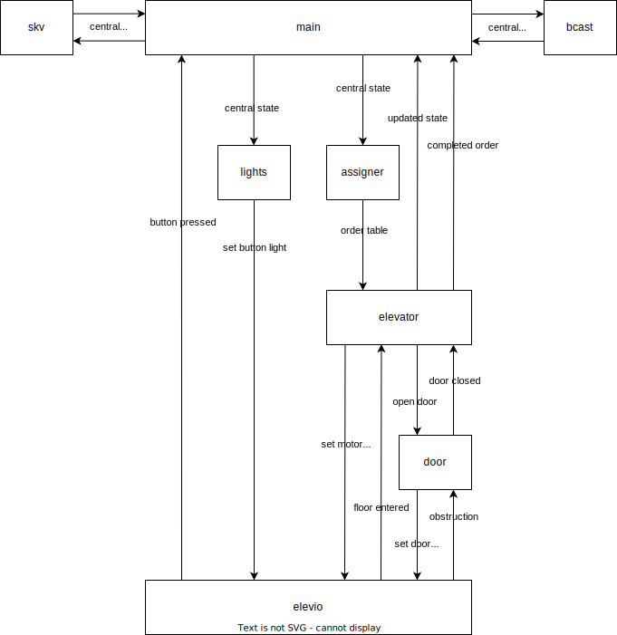

# Elevator project report
## Documentation
Module communication diagram showing what information is exchanged between modules.


Peculiar design choices listed below
### Use of timestamps
- Hall orders, and when they were served, are timestamped. This makes it easy to merge incoming state (both in normal operation and during reconnects): just keep the newest ones.
- Elevator state updates are also timestamped.

### No explicit error detection
- Network disconnects, packet losses and motor disconnects are not explicitly detected.

### Peer-to-peer continuous broadcasting, delayed lights and persistent storage - no acks
- The central state (containing orders, timestamps, and elevator state (basically the input for hall_request_assigner)) is broadcast and stored persistently regularly.
- Because of persistent storage, no orders are lost. This means that the light-button contract is fulfilled. However, 
- we are also delaying the button light updates by 20 times the broadcast interval, so that sufficient attempts have been made to broadcast the new order.

### Continuous order assignments with elevator timeouts
- Because elevator state updates are timestamped, it is easy to detect an elevator which should have moved or broadcast something. Whether this is due to door obstruction, network disconnect, packet loss, software crash or motor disconnect, we do not care.
- Orders are continuously (re)assigned by each elevator. Other assumed faulty elevators (we do not care whether we ourselves are faulty) are removed from the assignments. The assignments are not broadcast, because all elevators should agree on which takes which in normal operation.

### Considerations regarding timestamps
While nodes are connected together and to the internet, their clocks are synced up (NTP). There would be no problem syncing clocks without a internet connection, but this has not been implemented because nodes are also connected to the internet when they are connected together in this course. However, if nodes are disconnected, their clocks may fall out of sync. This can be a problem in some very specific scenarios, but as this requires very long disconnect periods, this is deemed unproblematic in this context.

## Case studies of important decisions

### Ordering of events
As the ordering of events matters, we need a mechanism to determine which happens first of two events. One way of doing this is assigning a sequence number to events, another is timestamping.

Using sequence numbers one have to deal with two events being assigned the same sequence numbers. One also gets a problem if nodes are disconnected from the network. Two events can be timestamped in the same nanosecond, although this is very unlikely. If this were to happen, it would resolve itself during subsequent (re)transmissions. Therefore, the timestamp way was chosen. However, using timestamps also requires synchronized clocks, see "considerations regarding timestamps" above.

### The button light contract
The spec demands that when a button light is turned on, an elevator will arrive at that floor. I.e. confirmed orders can not be lost. This can be solved by requiring other nodes to acknowledge an order or saving the order to persistent storage before turning on the light.

As acknowledgment requires more code and more interconnection between modules, the persistent storage way was chosen. However, the spec is interpreted as to require the order to be broadcast to other elevators before turning on the light. Therefore lights are delayed 20 times the transmission interval to ensure that sufficient attempts to transmit has been done.

### Error detection and handling
As hall_request_assigner is used, error handling is as simple as excluding erroneous elevators when assigning. However, the task of detecting that an elevator is erroneous was an interesting design decision. We found two alternatives: explicit and implicit error detection.

#### Explicit error detection
Detecting obstruction is trivial. Detecting motor stop requires a timer. Detecting crash/disconnect requires heartbeats and a timer. This is an explicit error detection.

#### Implicit error detection
Elevator state changes are timestamped. If we do not have a recent state change for an elevator which should be moving, we know that it is erroneous.
(An obstructed elevator will not change its state, neither will an elevator with motor stop. A crashed or disconnected node will not manage to send the change. Therefore we can rely on this mechanism)

#### Decision
We went with the implicit one, because it is simpler, and therefore more difficult to get wrong. However, there are downsides to this decision. If the spec changed to include some different behaviour for different errors, we would maybe have to restructure completely. Also this solution is slower than the explicit one, because we wait for a timeout on the obstruction, instead of immediately deem that the obstructed elevator is erroneous.

## Lesson learned - pure functions and immutability
Thinking in terms of pure functions and immutability has proven itself in this project. Writing pure functions forces in many ways better code because it forces separation of concern, and avoiding functions that does it all. It also makes code testable. Doing this from the start would have made things go a lot faster and smoother.

Although, the code would be better from the start if design was done with a larger emphasis on pure functions, an outright mistake done during development was not thinking in terms of immutability, especially when writing concurrent code. Before ```CentralState``` was made immutable, weird stuff would happen when it was mutated, because at least two threads accesses it at a time.
